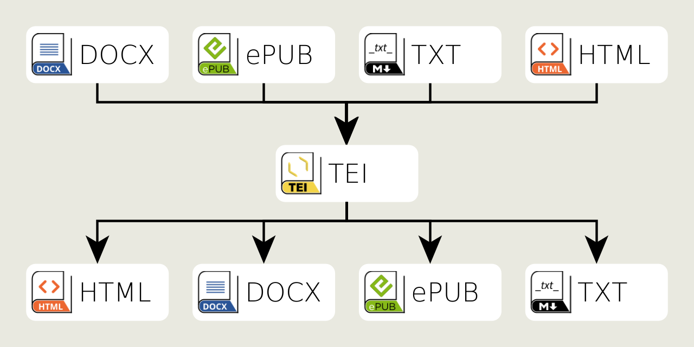
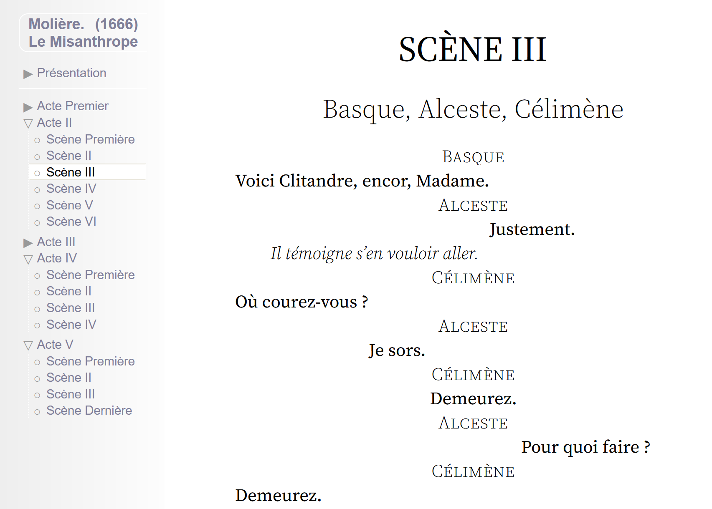
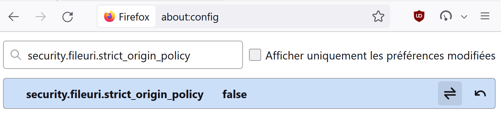

# Teinte, TEI shades, XSL pack

[teinte_xsl](https://github.com/oeuvres/teinte_xsl/) is an XSLT-1.0 pack to transform TEI documents, from, and to, different formats.




This pack ic compatible with xsltproc and other XSLT engine. Tested with
 * PHP: [teinte_php](https://github.com/oeuvres/teinte_php)
 * Java: [alix](https://github.com/oeuvres/alix)
 * Python: a command line pilot for Python is planned, needs support [teinte_py](https://github.com/oeuvres/teinte_py)
 * Javascript: direct transformation in browser (see below)
 * Bash: (see below)

# Browser

All modern browsers has the xsltproc library embedded. This allows to provide direct transformations in the browser. Visit for example this [example XML file](https://oeuvres.github.io/teinte_xsl/tests/moliere_misanthrope.xml) under a web server, you should see a nicely formatted theatre play, even if it’s an [XML/TEI source](https://github.com/oeuvres/teinte_xsl/tests/moliere_misanthrope.xml).



The magic rely on the XML prolog of the file

```xml
<?xml version="1.0" encoding="UTF-8"?>
<!-- Link to a transformation for the browser over https:// -->
<?xml-stylesheet type="text/xsl" href="https://oeuvres.github.io/teinte_xsl/tei_html.xsl"?>
```

This is really useful for XML/TEI edition for local file. For security reasons, most browsers do not allow you to use XSL transform through the internet (https://) from a local file. This security can be bypassed in Firefox.


1. in address bar, type `about:config`
2. accept security alert
3. search for the property: security.fileuri.strict_origin_policy
4. set to false

